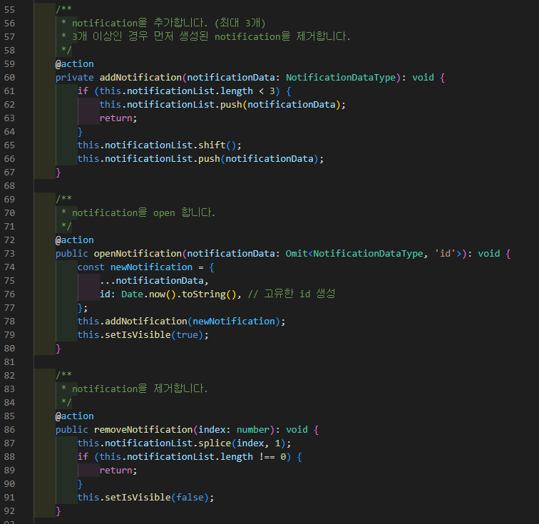

# 탄소 절감을 위한 메일 솔루션 웹 서비스

### **Description.** 

디지털 탄소 배출 절감을 위한 AI 기반 데이터 분석 Dashboard ([URL](https://noseaj.github.io/DCE\_FrontEnd/))

**Team :** 4명

**Role :** UI 개발 및 기획

**Contribution :** 40%

**Skills Used :** `TypeScript` `React` `CSS`

### Goals. 

1. 불필요한 메일 정리를 통해 디지털 탄소 배출량을 줄인다.
2. 사용자의 친환경적인 디지털 습관을 형성하도록 돕는다.

### **Concept**.

<figure><figcaption></figcaption></figure>

### Result.

<figure><figcaption></figcaption></figure>

<figure><figcaption></figcaption></figure>

### **Expected Effect.**

1. **디지털 탄소 배출 절감** : 불필요한 메일 삭제를 유도해 누적되는 탄소 배출량을 줄여 환경 보호에 기여
2. **직관적 메일 관리**: 메일 분석 기능을 통해 불필요한 메일을 쉽게 파악하고 정리할 수 있음.
3. **시스템 리소스 절감** : 서버에 저장된 메일 데이터 양을 줄여 서버 자원과 전력 사용 감소에 도움이 됨.

### **Improvement Point.**

**탄소 배출 절감 시각화**: 사용자가 삭제한 메일로 절감된 탄소량을 수치화한다면 동기 부여를 강화할 수있다.

