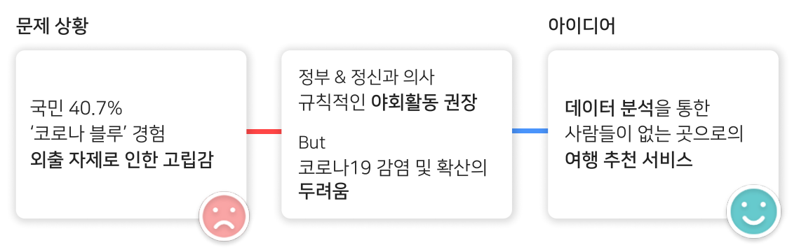

# UNTACT SPOT

### **Description.**&#x20;

유동인구 분석을 기반으로 혼잡도가 낮은 장소를 추천하는 모바일 웹 서비스 개발

**Achievements :** 종합 4위

**Team :** 4명

**Role :** UI 개발 및 기획

**Contribution :** 50%

**Skills Used :** `TypeScript` `React` `CSS` `Figma`

### Goals

1. **직관적인 정보 탐색**을 목표로 사용자가 필요한 장소를 쉽게 찾을 수 있도록 한다.
2. **필터링 기능**과 **실시간 안전도 평가**를 적용해 신뢰할 수 있는 정보를 제공할 수 있다.

<figure><figcaption></figcaption></figure>

### **Concept.**

<figure><figcaption></figcaption></figure>

### **Result**

<figure><figcaption></figcaption></figure>

<figure><figcaption></figcaption></figure>

**Expected Effect.**

1. **코로나 블루 해소 :** 야외 언택트 관광을 통해 심리적 안정 도모.
2. **여행 니즈 충족 :** 거리두기 방역 수칙을 준수하며, 여행에 대한 니즈를 충족시킬 수 있음.
3. **지역 경제 활성화 :** 소외된 지역으로의 방문 증가로 지역 경제 회복에 기여할 수 있음.

**Improvement Point**

유동인구 분석에 따른 실시간 알림 기능을 추가한다면, 사용자가 혼잡도를 미리 파악해 안전한 장소를 선택할 수 있다.
